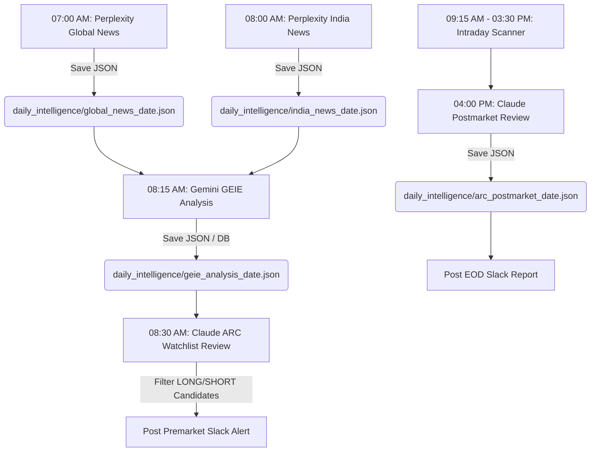

# IIIS v4.6 — System Architecture & Component Mapping

This document serves as the authoritative map of the **Institutional Intraday Intelligence System (IIIS) v4.6** codebase. It outlines the technology stack, daily timelines, execution lifecycles, and component-to-component wiring. Use this map in future agent sessions to understand the architecture quickly, minimize token consumption, and avoid regression bugs when editing components.

---

## 1. System Core & Registry Bootstrap

At startup, the system initializes services and registers them in a centralized lookup registry, allowing simple dependency injection.

- **Main Entry Point**: [`main.py`](file:///c:/Users/shadab/Desktop/trade/main.py)
  - Loads environment configurations from [`.env`](file:///c:/Users/shadab/Desktop/trade/.env).
  - Initializes database schema using [`database.py`](file:///c:/Users/shadab/Desktop/trade/database.py).
  - Triggers mock historical database seeding via [`seeder.py`](file:///c:/Users/shadab/Desktop/trade/seeder.py).
  - Boots background schedulers, monitors, and the live scan loop.
- **Service Registry**: [`bootstrap.py`](file:///c:/Users/shadab/Desktop/trade/bootstrap.py)
  - Instantiates and registers production or mock adapters in `ServiceRegistry` based on `.env` configuration (e.g. `MOCK_MODE=True`).
  - Registers the Slack webhook writer, Telegram bot handler, Upstox adapter, Perplexity API handler, Gemini API interface, and Claude API interface.
- **Configuration Registry**: [`config.py`](file:///c:/Users/shadab/Desktop/trade/config.py)
  - Validates required production credentials, timezone mappings, and risk-management variables.

---

## 2. Chronological Daily Timeline & News Ingestion

The chronological sequence is driven by [`scheduler.py`](file:///c:/Users/shadab/Desktop/trade/scheduler.py) on trading days, fetching news and feeding downstream AI engines:



- **Perplexity News Ingestion (Prompt 1 & 2)**:
  - Configured in [`production/perplexity_production.py`](file:///c:/Users/shadab/Desktop/trade/production/perplexity_production.py).
  - *Perplexity Fallback*: If `PERPLEXITY_API_KEY` contains "mock" and a real `GEMINI_API_KEY` is present, it automatically falls back to `GeminiProduction` with `enable_search=True` (Google Search Grounding) to fetch news for free.
- **Gemini GEIE Stock Impact Map (Prompt 3)**:
  - Configured in [`production/gemini_production.py`](file:///c:/Users/shadab/Desktop/trade/production/gemini_production.py#L166-L260).
  - Maps global/Indian news to positive, negative, or neutral directions for all 50 Nifty stocks. Persists results to the database table `geie_events` via [`geie_engine/persistence.py`](file:///c:/Users/shadab/Desktop/trade/geie_engine/persistence.py).
- **Claude ARC Premarket Watchlist Review (Prompt 4)**:
  - Configured in [`production/claude_production.py`](file:///c:/Users/shadab/Desktop/trade/production/claude_production.py).
  - Reads positive GEIE stocks as `LONG CANDIDATES` and negative GEIE stocks as `SHORT CANDIDATES` to construct the active watchlist.
- **Claude Postmarket EOD Review (Prompt 7)**:
  - Configured in [`production/claude_production.py`](file:///c:/Users/shadab/Desktop/trade/production/claude_production.py).
  - Collects daily trading metrics and outputs a comprehensive post-market summary.

---

## 3. Market Scan Loop & Calendar Sleep Control

- **Intraday Market Scan**: [`live_scan_loop.py`](file:///c:/Users/shadab/Desktop/trade/live_scan_loop.py)
  - Ingests tick quotes every 60 seconds from the database `raw_ticks` cache (populated asynchronously via the persistent Upstox WebSocket stream).
  - Feeds symbols to the orchestrator to build candles and run engine evaluations.
- **Calendar & Sleep Controller**: [`market_calendar.py`](file:///c:/Users/shadab/Desktop/trade/market_calendar.py)
  - Identifies NSE market hours (9:15 AM - 3:30 PM), weekends, and national trading holidays.
  - Automatically calculates seconds until the next market open and puts the `LiveScanLoop` into deep sleep during off-market periods to conserve system memory and CPU resources.

---

## 4. Intraday Signal Lifecycle & Engine Confluence

When a tick quote arrives, it flows through technical, scoring, risk, and AI veto filters:

```
[Incoming DB Tick Cache]
       │
       ▼
[Technical Engines] ───► Trend Engine (Multi-timeframe structure)
       │            ───► SMC Engine (Break of Structure/CHoCH)
       │            ───► Options Engine (PCR & Strike Concentration)
       ▼
[Scoring Engine] ──────► Combines metrics to calculate composite technical score
       │
       ▼
[8 Risk Gates] ────────► Checks size, sector limit, daily budget, consecutive losses, etc.
       │
       ▼ (If passed risk gates)
[Gemini Live Check] ───► Live Signal Analyzer (Prompt 5: Options & breaking news check)
       │
       ▼ (If PROCEED / CAUTION)
[Claude Final Veto] ───► ARC Live Reviewer (Prompt 6: Sector concentrations & final check)
       │
       ▼ (If APPROVED)
[Slack Notification] ──► Dispatches formatting alert to Slack channel #trading
```

- **Trend Engine**: [`market_structure/trend_engine.py`](file:///c:/Users/shadab/Desktop/trade/market_structure/trend_engine.py)
  - Evaluates multi-timeframe trends (5m, 15m, 1h, Daily) using historical candles.
- **SMC Engine**: [`market_structure/smc_engine.py`](file:///c:/Users/shadab/Desktop/trade/market_structure/smc_engine.py)
  - Analyzes market structures for Break of Structure (BOS) and Change of Character (CHoCH).
- **Options Engine**: [`options_engine/options_writer.py`](file:///c:/Users/shadab/Desktop/trade/options_engine/options_writer.py)
  - Pulls Open Interest (OI) buildup, Put-Call Ratio (PCR), and strike concentrations.
- **Scoring Engine**: [`scoring_engine/score_calculator.py`](file:///c:/Users/shadab/Desktop/trade/scoring_engine/score_calculator.py)
  - Merges technical parameters and outputs a composite score. Alerts require a score **strictly above 85** to progress.
- **Orchestration Coordinator**: [`orchestrator.py`](file:///c:/Users/shadab/Desktop/trade/orchestrator.py)
  - Handles the pipeline orchestration. Queries previous signal records from the database at runtime to compute dynamic accuracy stats (`win_rate`) to supply to the AI review prompts.

---

## 5. Risk Management & AI Veto Gates

- **Risk Engine**: [`risk_gates/risk_engine.py`](file:///c:/Users/shadab/Desktop/trade/risk_gates/risk_engine.py)
  - Implements **8 Risk Gates**:
    1. *Active Alerts Limit*: Maximum of 4 active alerts allowed simultaneously.
    2. *Sector Concentration Limit*: Maximum of 2 alerts in the same sector within 30 minutes.
    3. *Position Sizer*: [`risk_gates/position_sizer.py`](file:///c:/Users/shadab/Desktop/trade/risk_gates/position_sizer.py) calculates exact trade quantity matching **0.5% risk per trade**.
    4. *Daily Loss Limit*: Maximum daily risk budget capped at **2.0% of total capital**.
    5. *Hard Stop*: Pauses operations if 3 consecutive losses occur.
    6. *Ghost Mode*: [`ghost_mode.py`](file:///c:/Users/shadab/Desktop/trade/ghost_mode.py) blocks live alert propagation on consecutive losses, requiring a manual operator resume.
    7. *Duplicate Signals Gate*: Discards alerts for symbols already under active watch.
    8. *Bid-Ask Spread Gate*: Validates bid-ask slippage margins.
- **Gemini Live Signal Analyzer (Prompt 5)**:
  - [`production/gemini_production.py`](file:///c:/Users/shadab/Desktop/trade/production/gemini_production.py#L262-L335).
  - Validates options data and confirms whether morning news GEIE macro sentiment is still valid. Returns `PROCEED`, `CAUTION`, or `BLOCK`.
- **Claude Live Signal Reviewer (Prompt 6)**:
  - [`production/claude_production.py`](file:///c:/Users/shadab/Desktop/trade/production/claude_production.py).
  - Reviews sector concentrations and issues the final `APPROVED`, `CAUTION`, or `REJECT` verdict.
- **Alert Dispatcher**: [`production/slack_production.py`](file:///c:/Users/shadab/Desktop/trade/production/slack_production.py)
  - Dispatches approved alerts to Slack `#trading`. Connects via Webhook URL or Bot Token (`xoxb-`).

---

## 6. Database Hypertables (PostgreSQL + TimescaleDB)

Defined in [`schema.sql`](file:///c:/Users/shadab/Desktop/trade/schema.sql) and managed via [`database.py`](file:///c:/Users/shadab/Desktop/trade/database.py). The system maintains 16 core tables:
1. `market_data`: Real-time stock candle historical bars (Hypertables).
2. `raw_ticks`: Ticks data cache.
3. `options_intelligence`: Expiry strikes, Open Interest, and PCR levels.
4. `geie_events`: Morning macroeconomic news impact matrix.
5. `signals`: Generated signals (approved, rejected, or closed).
6. `risk_state`: Today's risk consumption budget tracking.
7. `audit_log`: Append-only system process audit trails.
8. `regime_history`: Daily calculated market regimes (BULLISH/BEARISH/CONSOLIDATION).
9. `founder_notes`: Operator notes and habit journaling.
10. `trade_replays`: Dynamic trade candles and volume logs for replay.
11. `trade_pattern_library`: Captured setup structures.
12. `trade_graveyard`: Historical loss signals for pattern learning.
13. `tomorrow_intelligence`: Premarket watchlists for tomorrow's trade planning.
14. `memory_insights`: AI-generated cognitive feedback.
15. `daily_reports`: Compiled daily performance report cards.
16. `session_state`: Temporary state persistence.

---

## 7. Performance & Token Optimization Guidelines

When editing the codebase, adhere to these constraints:

1. **Free Health Monitor Checks**:
   - [`health_monitor.py`](file:///c:/Users/shadab/Desktop/trade/health_monitor.py) runs health checks. 
   - Outside trading hours, health checks are throttled to **10 minutes**.
   - If a real production adapter is configured, health checks bypass expensive LLM completion calls. Instead, they check hostname connectivity via a **free TCP socket ping on port 443** (targeting `generativelanguage.googleapis.com`, `api.anthropic.com`, and `api.perplexity.ai`), saving API token costs.
2. **Upstox Rate Limit Protection**:
   - The scanner loop pulls price data directly from the PostgreSQL `raw_ticks` database cache. Do NOT insert direct Upstox REST API calls into the 60-second scanning cycle.
3. **90-Second Gemini Timeout**:
   - Gemini requests use a `TIMEOUT = 90` second configuration in [`production/gemini_production.py`](file:///c:/Users/shadab/Desktop/trade/production/gemini_production.py#L17). Ensure all search-grounded or heavy stock analysis prompts respect this threshold.
4. **Pytest Verification**:
   - Run `pytest` before any Git push to ensure all **136 unit tests** pass cleanly.
